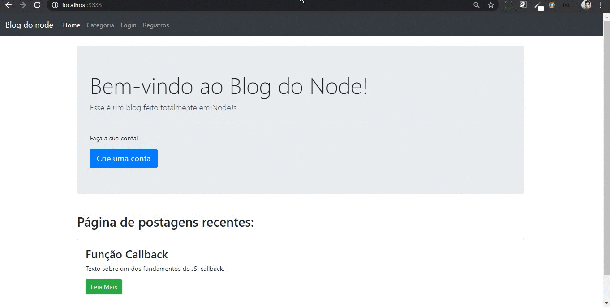
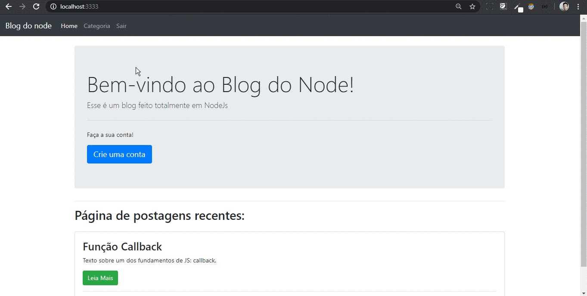

# Blogapp
[Blog](https://blogapp-gdp.herokuapp.com/ "Blog") desenvolvido junto com a [playlist](https://www.youtube.com/channel/UC_issB-37g9lwfAA37fy2Tg "playlist") de Node JS  do canal [Vitor Lima - Canal do Programador](https://www.youtube.com/watch?v=LLqq6FemMNQ&list=PLJ_KhUnlXUPtbtLwaxxUxHqvcNQndmI4B "Vitor Lima - Canal do Programador ").

Intuito do blog é proporcionar a visualização de postagens. Cada postagem tem uma categoria específica que pode ser criada por um usuário adm cadastrado. Por padrão qualquer usuário cadastrado não é adm.

## Criação de conta

## Categoria/postagem

# Tecnologias utilizadas
- Node JS
- Express
- Bootstrap
- Mongoose
- MongoDB
- bcrypt
- Passport
